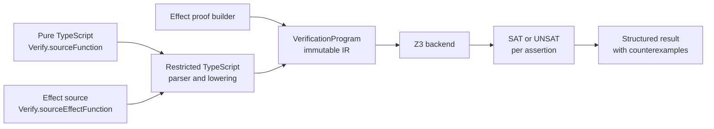

# Architecture

## Scope

Effect Verify has three proof frontends:

1. an Effect program that emits an explicit symbolic proof
2. a source frontend for restricted pure TypeScript functions
3. a source frontend for restricted `Effect.succeed` and `Effect.fail` outcomes

The source frontends fail closed. They do not execute the target module, infer arbitrary TypeScript behavior, or silently approximate unsupported syntax.

## Pipeline



The symbolic builder runs in the host process and emits IR. Pure and Effect source proofs are lowered from parsed TypeScript. Every frontend produces the same `VerificationProgram`; the backend does not know which frontend created it.

## Packages

### `@effect-verifier/core`

Owns the opaque `Sym<A>` wrapper, typed boolean, integer, and string expressions, input domains, the proof builder, source-proof specifications, normalized programs, result types, and the backend interface.

`compileProof` provides a fresh proof-builder service and records variables, assumptions, and assertions as immutable IR. This package does not import Z3 or the TypeScript compiler.

### `@effect-verifier/z3`

Implements the backend with the maintained `z3-solver` API. It translates mathematical integers, booleans, and finite string choices to Z3. The backend:

- checks that shared assumptions are satisfiable
- checks that division or modulo divisors are nonzero before each assertion
- asks whether each `assumptions && !assertion` query is satisfiable
- returns every modeled input and result in a SAT counterexample
- treats solver `unknown`, malformed IR, and model-decoding failures as errors

Checks through one backend instance are serialized. The backend creates one Z3 context when it is initialized and creates a fresh solver for each verification program, keeping proof variables isolated without rebuilding the context for every proof. Its worker threads are closed by the owner.

### `@effect-verifier/schema`

Translates a small, explicit subset of the public Effect Schema AST. The allowlist covers booleans, safe integers and numeric refinements, same-sort literal unions, required records, and fixed tuples. Its `Verify` object adds `anySchema` to the core builder.

Unsupported or ambiguous AST nodes produce `UnsupportedSchemaError`. There is no concrete-value fallback. Schema translation is tested against the Effect version pinned by the workspace.

### `@effect-verifier/typescript`

Uses the `@typescript/typescript6` compatibility package as a parser while the repository itself builds with TypeScript 7.

For `Verify.sourceFunction`, it finds one exported function or exported `const` arrow function, validates explicit `number` or `boolean` signatures and finite safe-integer numeric domains, and lowers the supported expression, conditional, immutable-local, and counted-loop subset. It uses static interval analysis to keep source arithmetic within JavaScript's safe-integer range.

For `Verify.sourceEffectFunction`, it additionally resolves the actual imported `Effect.Effect` return type, `Effect.succeed`, and `Effect.fail`, then lowers finite conditional outcomes with `number` or `boolean` success payloads and declared string-literal failure tags.

Both frontends use the TypeScript checker to resolve the proof export's first type argument, including aliases, and require it to identify the canonical file named by `sourceFile`. Missing or ambiguous identity fails closed. The target function is parsed, not imported or invoked. Declared source input domains become preconditions on the generated proof; the frontend does not validate application callers.

### `@effect-verifier/cli`

Loads one selected proof export from a `.ts` or `.js` module, runs the matching frontend, sends the resulting program to Z3, and prints JSON. It keeps formatting and process exit codes outside the core and backend packages.

The CLI exits:

- 0 when the result is `Verified`
- 1 when the result is `Failed`
- 2 for usage, proof compilation, source compilation, schema translation, solver, or output errors

## Integer representation

All numeric symbolic values are mathematical integers represented by Z3 `Int`, not machine integers, bitvectors, or general IEEE-754 numbers. Bounds are inclusive. For example, `Verify.uint({ bits: 8 })` adds:

```text
0 <= value <= 255
```

Symbolic arithmetic uses mathematical integer semantics. `Verify.uint` and `Verify.int` are convenience domains, not wrapping machine arithmetic. For example, adding one to a symbolic `UInt8` may produce 256, which Z3 can use as a counterexample.

Source proofs are narrower. They model JavaScript only when finite integer inputs and static interval analysis prove that every numeric result remains within `Number.MIN_SAFE_INTEGER` through `Number.MAX_SAFE_INTEGER`. Division, modulo, and arithmetic that may leave that range are rejected.

Integer `div` and `mod` in the symbolic API use SMT integer semantics. A divisor that can be zero under the shared assumptions is an operational error. Division and modulo are not supported inside assumptions.

## Proof construction

A core `Proof` stores an Effect program. It does not execute Z3. `Verify.any`, `Verify.anyString`, `Verify.assume`, and `Verify.assert` are effects that require the internal proof-builder service. `compileProof` supplies one fresh builder and captures the emitted IR.

The supported builder pattern is straight-line and declarative. Host-language branching, loops, mutation, I/O, arbitrary services, Promises, and other effects can change which constraints are emitted and are outside the modeled semantics. Assertion callbacks in source proofs are ordinary host code with the same restriction.

## Assertion semantics

For each assertion `P`, the backend asks whether:

```text
assumptions && !P
```

is satisfiable.

A SAT result yields a failed assertion and one model for that assertion. UNSAT verifies that assertion within the encoded model and domains. Assertions are checked independently under the same shared assumptions.

A backend rejects proofs with no assertions and assumptions with no model. This prevents a structurally invalid or vacuous proof from being reported as `Verified`.

## Ownership boundaries

- Core defines the proof and program types. It does not depend on a solver or parser.
- Z3 consumes only normalized program IR. It does not load proof modules or source files.
- The TypeScript package parses selected source and emits core program IR. It does not run the target function.
- Schema converts supported Effect Schema AST nodes into symbolic values. It does not validate concrete examples.
- The CLI coordinates these packages and formats their results.

See the [soundness contract](soundness.md) for the modeled subset and trust boundaries.
